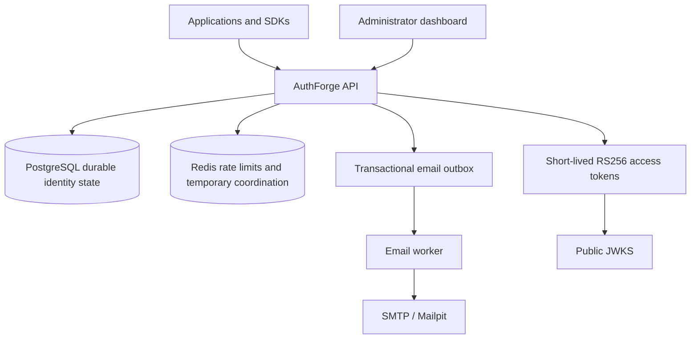

# Architecture

PostgreSQL is authoritative for credentials, sessions, refresh families, tenants, RBAC, API keys, OAuth clients, authorization codes, and security/audit events. Redis loss can reset abuse counters but cannot create an authenticated identity or revive a revoked credential.

